Codebook
================
Jacob Dubbert
8/1/2018

Download of Data
----------------

The data comes from the Word Development Indicators (WDI) from the World Bank. Specifically, the WDI R package which includes a broad selection of WDI indicators. The relevant data used for analysis are GDP (current US)(′*N**Y*.*G**D**P*.*M**K**T**P*.*C**D*′), *f**o**r**e**i**g**n**d**i**r**e**c**t**i**n**v**e**s**t**m**e**n**t**n**e**t**i**n**f**l**o**w**s*(*B**o**P*, *c**u**r**r**e**n**t**U**S*) ('BX.KLT.DINV.CD.WD'), foreign direct investment net inflows (% of GDP) ('BX.KLT.DINV.WD.GD.ZS'), trade as a percentage of GDP ('NE.TRD.GNFS.ZS'), total population (SP.POP.TOTL), . GDP per capita was also calculated and used as an independent variable.

I then filtered out NAFTA countries specifically for my analysis. Next, for readability, I converted the FDI and GDP values to billions and made them each new variables. Additionally, I added a NAFTA variable to specify which years in the data were under NAFTA and which were not. NAFTA went into effect on January 1, 1994, so the years 1994-2017 are coded as a TRUE and the years from 1970-1993 are coded as FALSE. To better develop my model to predict FDI inflows, I also added a GDP per capita variable.

Variables
---------

1.  FDI Net Inflows (`fdi`) - A continuous variable that measures foreign direct investment net inflows into a country annually, from 1970-2016, measured in millions USD. Inward flows represent transactions that increase the investment that foreign investors have in enterprises resident in the reporting economy less transactions that decrease the investment of foreign investors in resident enterprises. This will be the main dependent variable in the analysis.

Time-Series Plot: FDI Net Inflows; NAFTA countries
--------------------------------------------------

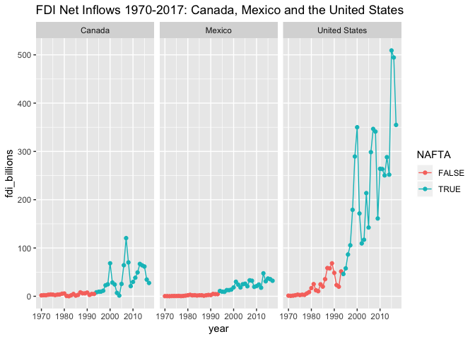

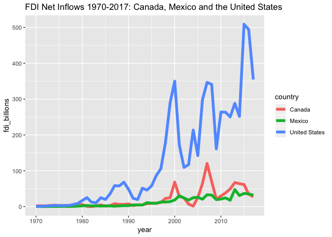

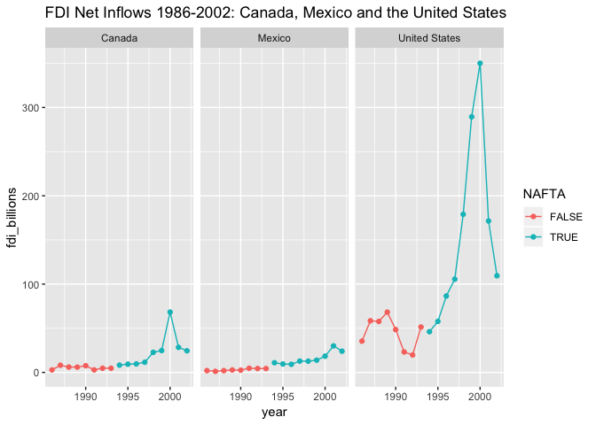

1.  FDI net inflows as a percent of GDP: A dependent variable that measures FDI inflows as a percentage of GDP. This will be used as an alternative dependent variable to pure FDI inflows. The dataset covers the years 1970-2017.

Time-Series Plot: FDI Net Inflows (% of GDP); NAFTA Countries
=============================================================

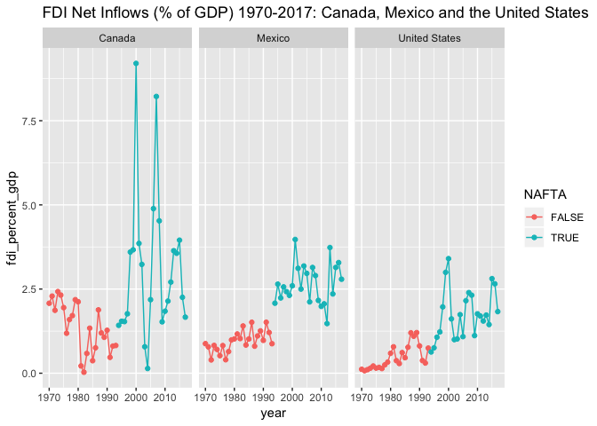

1.  Gross Domestic Product (`gdp`) - GDP is a continuous variable and is from 1970-2017. Gross domestic product (GDP) at current US$. The dataset covers the years 1970-2017.

Time-Series Plot: GDP; NAFTA Countries
======================================

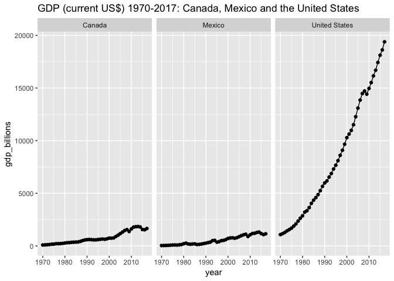

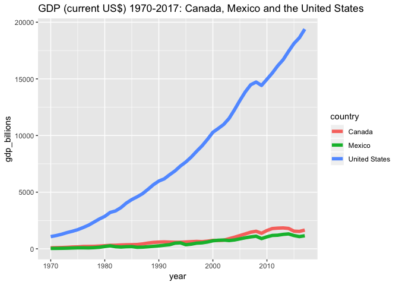

1.  Trade openness (`trade`) - A continuous variable that takes total exports + imports as a percentage of GDP. The dataset covers the years 1970-2017.

Time-Series Plot: Trade; NAFTA Countries
========================================

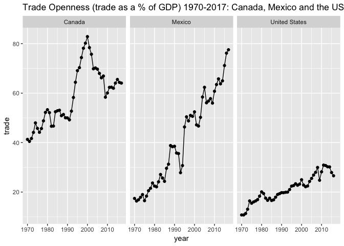

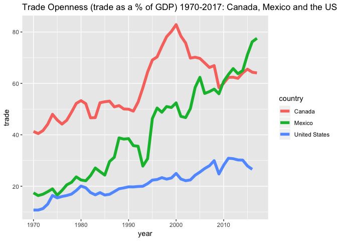

Histogram of Trade Openness; NAFTA countries
--------------------------------------------

    ##         Min.      1st Qu.       Median         Mean      3rd Qu. 
    ##     90047128   2893596812  15405261345  54025985936  47806870936 
    ##         Max. 
    ## 509087000000

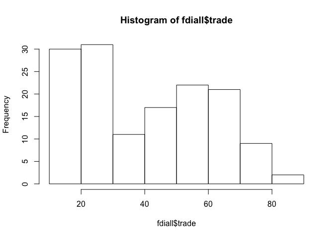

1.  Population (`pop`) - A continuous variable that is total yearly population. The dataset covers the years 1970-2017.

Time-Series Plot: Population; NAFTA Countries
---------------------------------------------

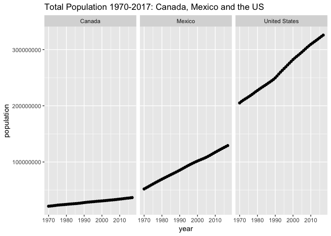

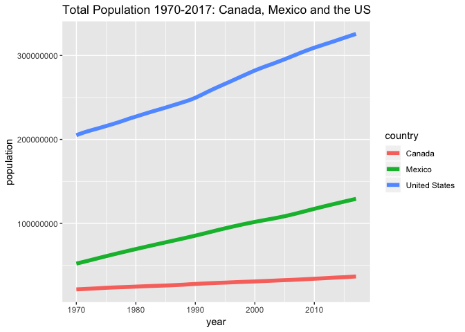

1.  GDP per Capita (`gdp_per_cap`) - A continuous variable that represents the gross domestic product per capita of each country. The dataset covers the years 1970-2017.

Time-Series Plot: GDP per Capita; NAFTA Countries
-------------------------------------------------

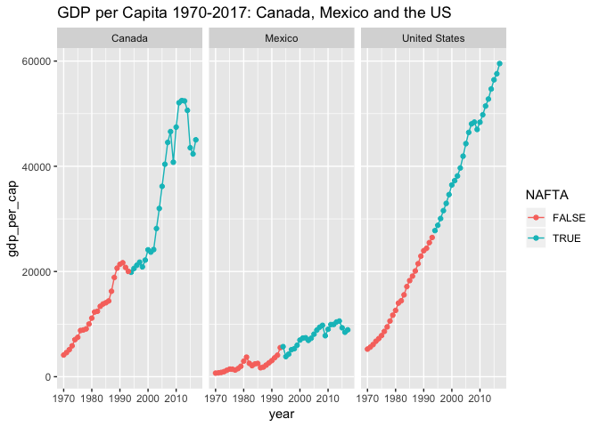

1.  Year (`year`) - This is the four-digit year. The dataset covers 1970-2017.

| Var1 |  Freq|
|:-----|-----:|
| 1970 |     3|
| 1971 |     3|
| 1972 |     3|
| 1973 |     3|
| 1974 |     3|
| 1975 |     3|
| 1976 |     3|
| 1977 |     3|
| 1978 |     3|
| 1979 |     3|
| 1980 |     3|
| 1981 |     3|
| 1982 |     3|
| 1983 |     3|
| 1984 |     3|
| 1985 |     3|
| 1986 |     3|
| 1987 |     3|
| 1988 |     3|
| 1989 |     3|
| 1990 |     3|
| 1991 |     3|
| 1992 |     3|
| 1993 |     3|
| 1994 |     3|
| 1995 |     3|
| 1996 |     3|
| 1997 |     3|
| 1998 |     3|
| 1999 |     3|
| 2000 |     3|
| 2001 |     3|
| 2002 |     3|
| 2003 |     3|
| 2004 |     3|
| 2005 |     3|
| 2006 |     3|
| 2007 |     3|
| 2008 |     3|
| 2009 |     3|
| 2010 |     3|
| 2011 |     3|
| 2012 |     3|
| 2013 |     3|
| 2014 |     3|
| 2015 |     3|
| 2016 |     3|
| 2017 |     3|

    ## year
    ## 1970 1971 1972 1973 1974 1975 1976 1977 1978 1979 1980 1981 1982 1983 1984 
    ##    1    1    1    1    1    1    1    1    1    1    1    1    1    1    1 
    ## 1985 1986 1987 1988 1989 1990 1991 1992 1993 1994 1995 1996 1997 1998 1999 
    ##    1    1    1    1    1    1    1    1    1    1    1    1    1    1    1 
    ## 2000 2001 2002 2003 2004 2005 2006 2007 2008 2009 2010 2011 2012 2013 2014 
    ##    1    1    1    1    1    1    1    1    1    1    1    1    1    1    1 
    ## 2015 2016 2017 
    ##    1    1    1

1.  Free Trade Agreement (`NAFTA`) - This will be a dummy categorical variable with a value of 1 for every year with an FTA (NAFTA) and 0 for a year without. NAFTA went into effect in 1994, so the years 1994 and after will have a value of 1. The dataset covers the years 1970-2017.

<!-- -->

    ##        
    ##         1970 1971 1972 1973 1974 1975 1976 1977 1978 1979 1980 1981 1982
    ##   FALSE    3    3    3    3    3    3    3    3    3    3    3    3    3
    ##   TRUE     0    0    0    0    0    0    0    0    0    0    0    0    0
    ##        
    ##         1983 1984 1985 1986 1987 1988 1989 1990 1991 1992 1993 1994 1995
    ##   FALSE    3    3    3    3    3    3    3    3    3    3    3    0    0
    ##   TRUE     0    0    0    0    0    0    0    0    0    0    0    3    3
    ##        
    ##         1996 1997 1998 1999 2000 2001 2002 2003 2004 2005 2006 2007 2008
    ##   FALSE    0    0    0    0    0    0    0    0    0    0    0    0    0
    ##   TRUE     3    3    3    3    3    3    3    3    3    3    3    3    3
    ##        
    ##         2009 2010 2011 2012 2013 2014 2015 2016 2017
    ##   FALSE    0    0    0    0    0    0    0    0    0
    ##   TRUE     3    3    3    3    3    3    3    3    3

    ## # A tibble: 48 x 1
    ##    NAFTA
    ##    <dbl>
    ##  1     0
    ##  2     1
    ##  3     1
    ##  4     1
    ##  5     1
    ##  6     1
    ##  7     1
    ##  8     0
    ##  9     0
    ## 10     0
    ## # … with 38 more rows

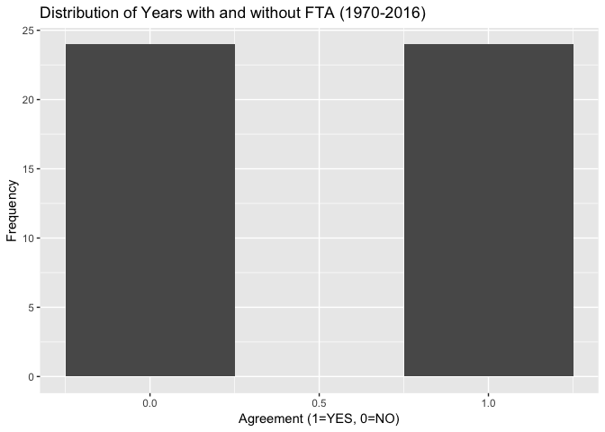

Summary Statistics
------------------

    ##                gdp        fdi     trade population gdppercapita
    ## Mean     3190.4708  54.025986  40.49861  127749968   19403.4670
    ## Stdev    4863.6718  98.266143  19.98166  102777927   16658.7599
    ## Median    999.2916  15.405261  38.79034   91474800   12987.7816
    ## Minimum    35.5200   0.090047  10.73037   21324000     682.6849
    ## Maximum 19390.6040 509.087000  82.85773  325719178   59531.6620
    ## nobs      144.0000 144.000000 144.00000        144     144.0000

Correlation Matrix
------------------

This correlation matrix was inspired from: <http://www.sthda.com/english/wiki/correlation-matrix-a-quick-start-guide-to-analyze-format-and-visualize-a-correlation-matrix-using-r-software>

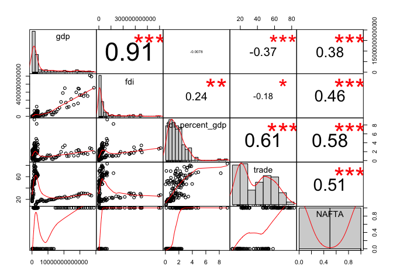
