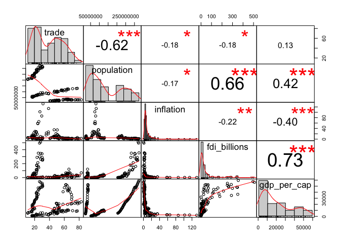
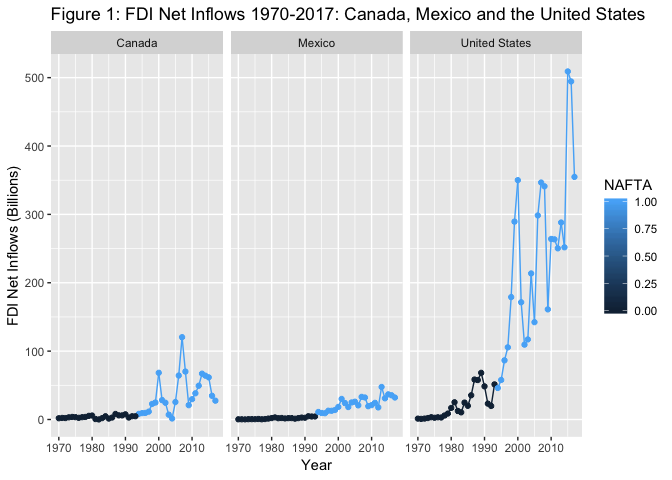
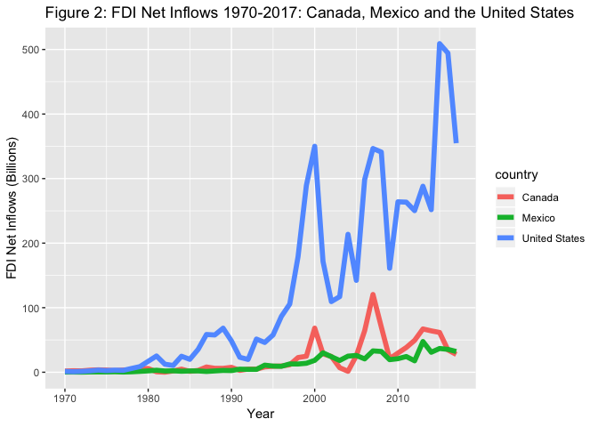
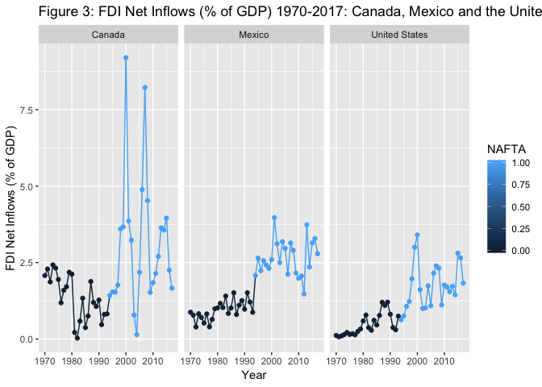
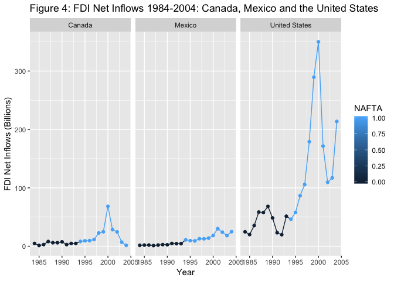
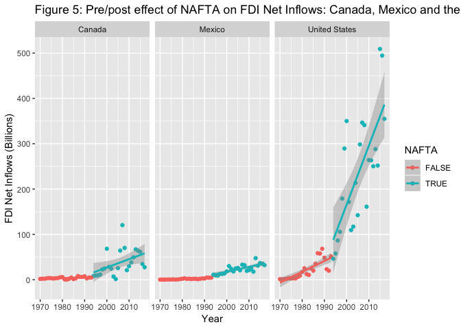

The Impact of NAFTA on FDI Net Inflows into Canada, Mexico and the United States
================
Jacob Dubbert
8/13/2018

|                                                                              |
|------------------------------------------------------------------------------|
|  |

The aim of this analysis is to explore the impact of free trade agreements (FTAs) on foreign direct investment (FDI). In particular, I will examine how multilateral FTAs effect FDI inflows of the involved countries. To do this, I will focus on the North American Free Trade Agreement (NAFTA), and its sequential effect on FDI inflows into the US, Canada and Mexico.

The purpose of exploring this question is to identify the benefits of FTAs in terms of FDI. Have FDI inward flows into the NAFTA region increased or decreased after the agreement? Which country benefitted most from NAFTA in terms of FDI? These questions are important to explore because the literature seems mixed on the actual effects. Additionally, free trade agreeements have been contested over the last few years, with many questioning the benefits of them. This has been especially apparent in regards to NAFTA. However, it is widely determined in the literature that FDI benefits economies; therefore, if NAFTA increased FDI into the three countries involved, there is a large benefit to the FTA.

The objective of this analysis is to evaluate the actual FDI flows into all three NAFTA countries to critically assess the the impact NAFTA had on them individually, as well as for the entire region. My results using a comprehensive data set spanning a 37 year period (1980-2017) show that NAFTA had a positive impact on total inward FDI into the region as a whole, with an estimated increase in FDI net inflows of approximately $33.5 billion in NAFTA years. However, when analyzing the individual country effect, I find that the US was the main beneficiary of the agreement. In the next section, I will first briefly decribe the North American Free Trade Agreement (NAFTA) and foreign direct investment (FDI), and the reasons why a multilateral trade agreement such as NAFTA can significantly influence FDI flows. Second, a brief literature review is presented, followed by a discussion of the data and methodology used in the analysis. Subsequently, a visual analysis of FDI net inflows into each of the NAFTA countries over time is presented to assess prevalent trends. Finally, the results of the OLS regression models used to identify the relationship between FDI net inflows and NAFTA are described. An assessment and discussion of results are included in the last section.

Foreign Direct Investment (FDI) and the North American Free Trade Agreement (NAFTA)
-----------------------------------------------------------------------------------

FDI net inflows "are the value of inward direct investment made by non-resident investors in the reporting economy" (World Bank). Flows of FDI have been increasing significantly over time, and are influenced by many factors, including trade and investment policies. By liberalizing trade and investment rules and restrictions, countries can attract foreign investment which can be beneficial to a country's economy.

The North American Free Trade Agreement (NAFTA), implemented on January 1, 1994, created the largest free trade area in the world. NAFTA is a multilateral trade agreement between the United States, Canada, and Mexico, which sought to eliminate all tariffs and most non-tariff barriers among the three countries over a 15-year period. It also sought to reduce barriers to foreign direct investment, establish dispute resolution mechanisms, create rules of origin guidelines and protect intellectual property rights.

After more than twenty-four years, the future of NAFTA is uncertain. President Donald Trump has proposed to renegotiate or withdraw from the historic trade agreement, labeling it as one of the worst trade deals in American history. Many others have criticized it as well. However, many economists and academics identify the agreement as having a positive impact on trade flows, FDI flows and the overall economies of each of the nations involved.

While the trade liberalization aspect of the agreement recieves most of the attention, NAFTA had a few very important provisions in regards to investment. These include Most-Favored nation treatment, equal treatment for foreign investors and a dispute settlement mechanism. These provisions are seen as making the NAFTA region a more attractive destination for foreign investment.

Literature Review
-----------------

The literature has analyzed the impact of NAFTA on FDI inflows quite extensively; however, the exact impact lacks a consensus. Cuevas et al. (2005) found that FTAs have a significant positive effect on FDI flows and matter more for the smaller members of the agreement. For instance, NAFTA’s effect on FDI flows into Mexico are much larger than its effect on flows into the US, with total FDI flows nearly 60 percent higher than they would have been without the agreement. Similarily, MacDermott (2006) found strong evidence that NAFTA had a positive impact on FDI both in aggregate, as well as at the country level, for each of the member countries. Feils D. and Rahman M. (2008) also found that NAFTA had a generally positive effect on inward FDI into the entire region, but with the benefits accruing only to the US and Canada.

Data and Methodology
--------------------

In order to determine the impact of NAFTA on inward FDI, I examined FDI net inflows in Canada, Mexico and the United States between 1970 and 2017 as reported by the World Bank in its World Development Indicators. Specifically, the WDI R package is used which includes a broad selection of WDI indicators.

I use OLS regression models to test the impact of NAFTA on inward FDI both into the entire NAFTA region, and into each country individually. The dependent variable used in the analyses is fdi\_billions and measures foreign direct investment net inflows into a country annually, from 1970-2017. For ease of interpretation and analysis, I convert FDI values to billions USD.

The main independent variable is NAFTA, and the control variables are GDP per capita, trade openness, population, and inflation; all downloaded from the WDI database. A description and graph of each variable can be seen in the codebook here [link](file:///Users/jake/Documents/Applied%20Research%20in%20Data%20Science/dubbert_codebook2.html).

Descriptive Statistics
----------------------

The basic descriptive statistics of each variable can be seen below.

<table style="text-align:center">
<tr>
<td colspan="7" style="border-bottom: 1px solid black">
</td>
</tr>
<tr>
<td style="text-align:left">
Statistic
</td>
<td>
N
</td>
<td>
St. Dev.
</td>
<td>
Mean
</td>
<td>
Median
</td>
<td>
Min
</td>
<td>
Max
</td>
</tr>
<tr>
<td colspan="7" style="border-bottom: 1px solid black">
</td>
</tr>
<tr>
<td style="text-align:left">
year
</td>
<td>
144
</td>
<td>
13.902
</td>
<td>
1,993.500
</td>
<td>
1,993.5
</td>
<td>
1,970
</td>
<td>
2,017
</td>
</tr>
<tr>
<td style="text-align:left">
gdp
</td>
<td>
144
</td>
<td>
4,863,671,783,390.000
</td>
<td>
3,190,470,848,092.000
</td>
<td>
999,291,567,395.000
</td>
<td>
35,520,000,000.000
</td>
<td>
19,390,604,000,000.000
</td>
</tr>
<tr>
<td style="text-align:left">
fdi
</td>
<td>
144
</td>
<td>
98,266,143,482.000
</td>
<td>
54,025,985,936.000
</td>
<td>
15,405,261,345.000
</td>
<td>
90,047,128.000
</td>
<td>
509,087,000,000.000
</td>
</tr>
<tr>
<td style="text-align:left">
fdi\_percent\_gdp
</td>
<td>
144
</td>
<td>
1.352
</td>
<td>
1.709
</td>
<td>
1.494
</td>
<td>
0.029
</td>
<td>
9.202
</td>
</tr>
<tr>
<td style="text-align:left">
trade
</td>
<td>
143
</td>
<td>
19.982
</td>
<td>
40.499
</td>
<td>
38.790
</td>
<td>
10.730
</td>
<td>
82.858
</td>
</tr>
<tr>
<td style="text-align:left">
population
</td>
<td>
144
</td>
<td>
102,777,927.000
</td>
<td>
127,749,968.000
</td>
<td>
91,474,800
</td>
<td>
21,324,000
</td>
<td>
325,719,178
</td>
</tr>
<tr>
<td style="text-align:left">
inflation
</td>
<td>
144
</td>
<td>
19.766
</td>
<td>
10.524
</td>
<td>
4.176
</td>
<td>
-0.356
</td>
<td>
131.827
</td>
</tr>
<tr>
<td style="text-align:left">
exports
</td>
<td>
143
</td>
<td>
10.499
</td>
<td>
20.016
</td>
<td>
20.096
</td>
<td>
5.392
</td>
<td>
44.237
</td>
</tr>
<tr>
<td style="text-align:left">
fdi\_billions
</td>
<td>
144
</td>
<td>
98.266
</td>
<td>
54.026
</td>
<td>
15.405
</td>
<td>
0.090
</td>
<td>
509.087
</td>
</tr>
<tr>
<td style="text-align:left">
gdp\_billions
</td>
<td>
144
</td>
<td>
4,863.672
</td>
<td>
3,190.471
</td>
<td>
999.292
</td>
<td>
35.520
</td>
<td>
19,390.600
</td>
</tr>
<tr>
<td style="text-align:left">
NAFTA
</td>
<td>
144
</td>
<td>
0.502
</td>
<td>
0.500
</td>
<td>
0.5
</td>
<td>
0
</td>
<td>
1
</td>
</tr>
<tr>
<td style="text-align:left">
gdp\_per\_cap
</td>
<td>
144
</td>
<td>
16,658.760
</td>
<td>
19,403.470
</td>
<td>
12,987.780
</td>
<td>
682.685
</td>
<td>
59,531.660
</td>
</tr>
<tr>
<td colspan="7" style="border-bottom: 1px solid black">
</td>
</tr>
</table>
Correlation Between Variables
-----------------------------

Below is a correlation matrix showing the correlations between all variables used in the analysis. The correlation matrix was inspired from STHDA [link](http://www.sthda.com/english/wiki/correlation-matrix-a-quick-start-guide-to-analyze-format-and-visualize-a-correlation-matrix-using-r-software). As you can see below, the correlation between both GDP per capita and population and FDI net inflows is quite significant, at 0.73 and 0.66 respectively.

FDI Net Inflows in 1994 Across the World
----------------------------------------

Below is an interactive map of FDI net inflows in the year NAFTA was signed. The year can be changed to any year between 1970-2017 to compare FDI net inflows across the world. The map was produced with the Plotly package.

<!--html_preserve-->

<!--/html_preserve-->
Visual Analysis of FDI Net Inflows into the NAFTA Region
--------------------------------------------------------

The following analysis presents a visual depiction of FDI flows into Canada, Mexico and the US over time to provide a foundation for further analysis.

Analyzing FDI net inflows from 1970-2017 in Canada, Mexico and the United States
--------------------------------------------------------------------------------

Figures 1 and 2 below show the evolution of FDI net inflows into each of the NAFTA countries. The years under NAFTA are colored light blue while the years before NAFTA are dark blue. FDI inflows into the US clearly dwarf those of Canada and Mexico, but that is to be expected based on its much larger population, economy, history of low investment barriers and investment attractiveness. While net inflows have been steadily increasing since 1970 in each of the countries, there is no discernible pattern in the time period from 1970 to the mid-to-late 1980s. In the late 1980s, the US observed an uptick of FDI inflows until dropping off significantly in 1990-1991, before skyrocketing from around 1994 to 2000. In all three countries, FDI net inflows clearly start trending upward and spike up in the early 1990s. While NAFTA didnt go into effect until January 1994, the clear break in the trend is most likely in response to the negotiation and anticipated implementation of the agreement.

FDI net inflows (% of GDP) from 1970-2017
-----------------------------------------

Another way to analyze FDI net inflows is to observe them as a percent of GDP. This allows for a better comparison of net FDI inflows between Canada, Mexico and the US. In Figure 3 below, a structural change in FDI net inflows (% of GDP) in each of the three countries can be observed right around 1994 when NAFTA was implemented. The volatitlity in FDI flows seems to increase at that time as well. While FDI inflows in Mexico and the US follow a gradual uptrend after 1994 until 2017, Canada observes a large spike in FDI inflows around 2000, and then by 2017, FDI is back to levels seen before 1990.

Basic Statistics
----------------

To observe the effects of NAFTA, I will focus the analysis to 10 years before NAFTA was implemented and 10 years after. The tables below show basic statistics on the inflows of FDI into Canada, Mexico and the US. I compare the mean and the standard deviation of the flows for the years 1984-1993 (before NAFTA) in Table 1 and 1994-2004 (after NAFTA) in Table 2. As you can see from Table 1 and 2, the magnitude of FDI inflows into each of the three countries increases significantly after NAFTA went into effect. For Canada, the average annual FDI inflows in the 10 years after NAFTA increased almost 500% from the period before, FDI inflows into Mexico increased over 600%, and FDI inflows into the US increased almost 400%. The volatility of flows also increased quite significantly in all three countries, as seen by the standard deviation.

Table 1: FDI Inflows before NAFTA, 1984-1993
--------------------------------------------

| country       |       Mean|         SD|
|:--------------|----------:|----------:|
| Canada        |   4.915208|   2.136586|
| Mexico        |   2.761500|   1.288773|
| United States |  40.750600|  18.236558|

Table 2: FDI Inflows After NAFTA, 1994-2004
-------------------------------------------

| country       |       Mean|         SD|
|:--------------|----------:|----------:|
| Canada        |   19.62586|  18.435023|
| Mexico        |   16.79895|   6.959487|
| United States |  156.93300|  96.079520|

FDI Net Inflows 1984-2004
-------------------------

To get a better idea of the changes in net FDI inflows before and after NAFTA, Figure 4 looks at the FDI inflows ten years before the agreement was implemented and ten years after.

Pre/post effect of NAFTA on FDI Net Inflows: Canada, Mexico and the United States
---------------------------------------------------------------------------------

Figure 5 below is a similar graph as before, but with a smoothed trend line and partitioned into two panels; one representing before NAFTA (red line) and one representing after NAFTA (green line). This enables the ability to observe any real differences in trends between the two time periods. The trend line in all three countries clearly steepens after NAFTA goes into effect, with the US seeing a significant change. While the steepening trend in Canada and Mexico isn't as pronounced, there is still a considerable change observed.

Results
-------

The results from the regressions for the entire region are presented in Table 3 below. Model 1 tests the sole effect of NAFTA on FDI inflows; Model 2 considers both NAFTA and GDP; Model 3 condsider NAFTA, GDP and trade openness, as the literature identifies these as having a significant effect on FDI; and Model 4 brings in all other control variables; population and inflation.

In my final model, the NAFTA variable, representing the years in which the countries were part of the agreement, is both positive and statistically significant, suggesting that the implementation of NAFTA led to an increase in FDI for the region. Specifically, the estimated increase in FDI net inflows in NAFTA years is approximately $33.5 billion for the region as a whole. Thus, implementation of NAFTA increased investment flows into the member countries, validating the idea that trade agreements which liberalize trade and investment do in fact increase foreign investment.

Additionally, as GDP per capita increases, the flow of FDI increases as well. While this increase is minimal, it is statistically significant. Trade openness is found to be negative and insignificant, while inflation is found to be positive and significant at the 0.1 level.

<table style="text-align:center">
<caption>
<strong>Table 3: Regression Analysis of the Impact of NAFTA on FDI net inflows into All three NAFTA Countries</strong>
</caption>
<tr>
<td colspan="5" style="border-bottom: 1px solid black">
</td>
</tr>
<tr>
<td style="text-align:left">
</td>
<td colspan="4">
<em>Dependent variable:</em>
</td>
</tr>
<tr>
<td>
</td>
<td colspan="4" style="border-bottom: 1px solid black">
</td>
</tr>
<tr>
<td style="text-align:left">
</td>
<td colspan="4">
fdi\_billions
</td>
</tr>
<tr>
<td style="text-align:left">
</td>
<td>
(1)
</td>
<td>
(2)
</td>
<td>
(3)
</td>
<td>
(4)
</td>
</tr>
<tr>
<td colspan="5" style="border-bottom: 1px solid black">
</td>
</tr>
<tr>
<td style="text-align:left">
NAFTA
</td>
<td>
90.385\*\*\*
</td>
<td>
12.744
</td>
<td>
67.889\*\*\*
</td>
<td>
32.631\*\*
</td>
</tr>
<tr>
<td style="text-align:left">
</td>
<td>
(14.580)
</td>
<td>
(13.788)
</td>
<td>
(13.786)
</td>
<td>
(16.087)
</td>
</tr>
<tr>
<td style="text-align:left">
</td>
<td>
</td>
<td>
</td>
<td>
</td>
<td>
</td>
</tr>
<tr>
<td style="text-align:left">
gdp\_per\_cap
</td>
<td>
</td>
<td>
0.004\*\*\*
</td>
<td>
0.003\*\*\*
</td>
<td>
0.003\*\*\*
</td>
</tr>
<tr>
<td style="text-align:left">
</td>
<td>
</td>
<td>
(0.0004)
</td>
<td>
(0.0004)
</td>
<td>
(0.0004)
</td>
</tr>
<tr>
<td style="text-align:left">
</td>
<td>
</td>
<td>
</td>
<td>
</td>
<td>
</td>
</tr>
<tr>
<td style="text-align:left">
trade
</td>
<td>
</td>
<td>
</td>
<td>
-2.098\*\*\*
</td>
<td>
-0.405
</td>
</tr>
<tr>
<td style="text-align:left">
</td>
<td>
</td>
<td>
</td>
<td>
(0.287)
</td>
<td>
(0.510)
</td>
</tr>
<tr>
<td style="text-align:left">
</td>
<td>
</td>
<td>
</td>
<td>
</td>
<td>
</td>
</tr>
<tr>
<td style="text-align:left">
population
</td>
<td>
</td>
<td>
</td>
<td>
</td>
<td>
0.00000\*\*\*
</td>
</tr>
<tr>
<td style="text-align:left">
</td>
<td>
</td>
<td>
</td>
<td>
</td>
<td>
(0.00000)
</td>
</tr>
<tr>
<td style="text-align:left">
</td>
<td>
</td>
<td>
</td>
<td>
</td>
<td>
</td>
</tr>
<tr>
<td style="text-align:left">
inflation
</td>
<td>
</td>
<td>
</td>
<td>
</td>
<td>
0.442\*
</td>
</tr>
<tr>
<td style="text-align:left">
</td>
<td>
</td>
<td>
</td>
<td>
</td>
<td>
(0.258)
</td>
</tr>
<tr>
<td style="text-align:left">
</td>
<td>
</td>
<td>
</td>
<td>
</td>
<td>
</td>
</tr>
<tr>
<td style="text-align:left">
Constant
</td>
<td>
8.833
</td>
<td>
-31.315\*\*\*
</td>
<td>
39.921\*\*\*
</td>
<td>
-54.319\*\*
</td>
</tr>
<tr>
<td style="text-align:left">
</td>
<td>
(10.310)
</td>
<td>
(8.970)
</td>
<td>
(12.179)
</td>
<td>
(26.160)
</td>
</tr>
<tr>
<td style="text-align:left">
</td>
<td>
</td>
<td>
</td>
<td>
</td>
<td>
</td>
</tr>
<tr>
<td colspan="5" style="border-bottom: 1px solid black">
</td>
</tr>
<tr>
<td style="text-align:left">
Observations
</td>
<td>
144
</td>
<td>
144
</td>
<td>
143
</td>
<td>
143
</td>
</tr>
<tr>
<td style="text-align:left">
R2
</td>
<td>
0.213
</td>
<td>
0.532
</td>
<td>
0.648
</td>
<td>
0.685
</td>
</tr>
<tr>
<td style="text-align:left">
Adjusted R2
</td>
<td>
0.207
</td>
<td>
0.525
</td>
<td>
0.641
</td>
<td>
0.674
</td>
</tr>
<tr>
<td style="text-align:left">
Residual Std. Error
</td>
<td>
87.482 (df = 142)
</td>
<td>
67.710 (df = 141)
</td>
<td>
57.123 (df = 139)
</td>
<td>
54.419 (df = 137)
</td>
</tr>
<tr>
<td style="text-align:left">
F Statistic
</td>
<td>
38.429\*\*\* (df = 1; 142)
</td>
<td>
80.095\*\*\* (df = 2; 141)
</td>
<td>
85.416\*\*\* (df = 3; 139)
</td>
<td>
59.700\*\*\* (df = 5; 137)
</td>
</tr>
<tr>
<td colspan="5" style="border-bottom: 1px solid black">
</td>
</tr>
<tr>
<td style="text-align:left">
<em>Note:</em>
</td>
<td colspan="4" style="text-align:right">
*p&lt;0.1; **p&lt;0.05; ***p&lt;0.01
</td>
</tr>
</table>
Analyzing the impact of NAFTA on individual FDI net inflows into Canada, Mexico and the United States
-----------------------------------------------------------------------------------------------------

To better understand the impact of the agreement on FDI inflows, the following analysis looks at each NAFTA country individually. This will allow for the ability to assess the impact of NAFTA on each of the specific economies. Of course, since country characteristics vary significantly in Canada, Mexico and the US, it is important to analyze them seperately. The variables used in the individual country regressions are those from Model 4 in the regression for the entire region: FDI net inflows is the dependent variable and the independent variables are NAFTA, GDP, Trade, Population and Inflation.

Results: Individual impact of NAFTA on Canada, Mexico and the US
----------------------------------------------------------------

The results for the regression for each NAFTA member individually are reported in Table 4. While the regression above indicated a sizable positive impact of NAFTA on FDI net inflows into the entire NAFTA region, analyzing each country individually tells a different story.

The NAFTA variable has a positive and significant (p&lt;0.1) coefficient for the US; however, for Mexico it is positive but not statistically significant and for Canada it is negative and not statistically significant. The estimated increase in FDI in NAFTA years for the US is approximately $83.25 billion; while for Mexico it is $1.97 billion and for Canada it is -$7.19 billion. These results show that the highly developed US economy was the main beneficiary of increases in inward FDI stemming from NAFTA.

<table style="text-align:center">
<caption>
<strong>Table 4: Regression Analysis of the Individual Impact of NAFTA on FDI Net Inflows into All Three NAFTA Countries</strong>
</caption>
<tr>
<td colspan="4" style="border-bottom: 1px solid black">
</td>
</tr>
<tr>
<td style="text-align:left">
</td>
<td colspan="3">
<em>Dependent variable:</em>
</td>
</tr>
<tr>
<td>
</td>
<td colspan="3" style="border-bottom: 1px solid black">
</td>
</tr>
<tr>
<td style="text-align:left">
</td>
<td colspan="3">
fdi\_billions
</td>
</tr>
<tr>
<td style="text-align:left">
</td>
<td>
Canada
</td>
<td>
Mexico
</td>
<td>
US
</td>
</tr>
<tr>
<td style="text-align:left">
</td>
<td>
(1)
</td>
<td>
(2)
</td>
<td>
(3)
</td>
</tr>
<tr>
<td colspan="4" style="border-bottom: 1px solid black">
</td>
</tr>
<tr>
<td style="text-align:left">
NAFTA
</td>
<td>
-6.848
</td>
<td>
1.516
</td>
<td>
83.293\*\*
</td>
</tr>
<tr>
<td style="text-align:left">
</td>
<td>
(13.639)
</td>
<td>
(3.122)
</td>
<td>
(41.119)
</td>
</tr>
<tr>
<td style="text-align:left">
</td>
<td>
</td>
<td>
</td>
<td>
</td>
</tr>
<tr>
<td style="text-align:left">
gdp\_per\_cap
</td>
<td>
0.003\*\*\*
</td>
<td>
0.004\*\*\*
</td>
<td>
0.039\*\*\*
</td>
</tr>
<tr>
<td style="text-align:left">
</td>
<td>
(0.001)
</td>
<td>
(0.001)
</td>
<td>
(0.009)
</td>
</tr>
<tr>
<td style="text-align:left">
</td>
<td>
</td>
<td>
</td>
<td>
</td>
</tr>
<tr>
<td style="text-align:left">
trade
</td>
<td>
1.583\*\*\*
</td>
<td>
0.399\*\*
</td>
<td>
-0.390
</td>
</tr>
<tr>
<td style="text-align:left">
</td>
<td>
(0.547)
</td>
<td>
(0.180)
</td>
<td>
(7.786)
</td>
</tr>
<tr>
<td style="text-align:left">
</td>
<td>
</td>
<td>
</td>
<td>
</td>
</tr>
<tr>
<td style="text-align:left">
population
</td>
<td>
-0.00001\*\*\*
</td>
<td>
-0.00000
</td>
<td>
-0.00001\*\*\*
</td>
</tr>
<tr>
<td style="text-align:left">
</td>
<td>
(0.00000)
</td>
<td>
(0.00000)
</td>
<td>
(0.00000)
</td>
</tr>
<tr>
<td style="text-align:left">
</td>
<td>
</td>
<td>
</td>
<td>
</td>
</tr>
<tr>
<td style="text-align:left">
inflation
</td>
<td>
-0.039
</td>
<td>
-0.002
</td>
<td>
4.045
</td>
</tr>
<tr>
<td style="text-align:left">
</td>
<td>
(1.054)
</td>
<td>
(0.032)
</td>
<td>
(6.059)
</td>
</tr>
<tr>
<td style="text-align:left">
</td>
<td>
</td>
<td>
</td>
<td>
</td>
</tr>
<tr>
<td style="text-align:left">
Constant
</td>
<td>
115.502\*\*
</td>
<td>
6.323
</td>
<td>
2,810.735\*\*\*
</td>
</tr>
<tr>
<td style="text-align:left">
</td>
<td>
(51.131)
</td>
<td>
(9.489)
</td>
<td>
(896.692)
</td>
</tr>
<tr>
<td style="text-align:left">
</td>
<td>
</td>
<td>
</td>
<td>
</td>
</tr>
<tr>
<td colspan="4" style="border-bottom: 1px solid black">
</td>
</tr>
<tr>
<td style="text-align:left">
Observations
</td>
<td>
48
</td>
<td>
48
</td>
<td>
47
</td>
</tr>
<tr>
<td style="text-align:left">
R2
</td>
<td>
0.687
</td>
<td>
0.879
</td>
<td>
0.833
</td>
</tr>
<tr>
<td style="text-align:left">
Adjusted R2
</td>
<td>
0.650
</td>
<td>
0.864
</td>
<td>
0.813
</td>
</tr>
<tr>
<td style="text-align:left">
Residual Std. Error
</td>
<td>
15.420 (df = 42)
</td>
<td>
4.780 (df = 42)
</td>
<td>
59.866 (df = 41)
</td>
</tr>
<tr>
<td style="text-align:left">
F Statistic
</td>
<td>
18.436\*\*\* (df = 5; 42)
</td>
<td>
60.924\*\*\* (df = 5; 42)
</td>
<td>
41.004\*\*\* (df = 5; 41)
</td>
</tr>
<tr>
<td colspan="4" style="border-bottom: 1px solid black">
</td>
</tr>
<tr>
<td style="text-align:left">
<em>Note:</em>
</td>
<td colspan="3" style="text-align:right">
*p&lt;0.1; **p&lt;0.05; ***p&lt;0.01
</td>
</tr>
</table>
Conclusions
-----------

This study applied an OLS regression model to a data set of Canada, Mexico and the US in order to investigate the effects of NAFTA on foreign direct investment. Much like the previous literature, the evidence suggests that the agreement spurred an increase in FDI net inflows into the member countries as a whole; however, each country saw large deviations in effects individually. NAFTA is estimated to increase FDI net inflows into the NAFTA region by approximately $33.5 billion in NAFTA years, with the US being the main beneficary. Surprisingly, the net effect of NAFTA on Canada's FDI inflows was negative. This is a much different result than most previous literature (Cuevas et al. 2005; Feils & Rahman 2007; MacDermott 2007).

Further analysis of the NAFTA impact on FDI flows could be improved by using bilateral FDI flow data. This would allow for the ability to analyze individual country effects in more detail. Additionally, running regressions on different ranges of years (before and after NAFTA panels) could be done for a robustness check.

Sources
-------

Cardamone, Paola, Scoppola, Margherita. 2012 "The impact of EU preferential trade agreements on Foreign Direct Investment.' The World Economy.

Cuevas, Alfredo, Miguel Messmacher and Alejandro Werner. 2005. "Foreign Direct Investment in Mexico since the Approval of NAFTA." The World Bank Economic Review. Vol. 19(3).

Feils, Dorothee and Manzur Rahman. 2007. "Regional economic integration and foreign direct investment: The case of NAFTA." Management International Review.

Monge-Narangjo, Alexander. 2018. "The Impact of NAFTA on Foreign Direct Investment flows in Mexico and the Excluded Countries"

Moon, Jongchol. 2009. "The Influence of Free Trade Agreement on Foreign Direct Investment: Comparison with non-FTA countries"

Thangavelu, Shandre and Christopher Findlay. 2011. "Chapter 4 The Impact of Free Trade Agreements on Foreign Direct Investment in the the Asia-Pacific Region"

Walskirch, Andreas and Ayca Tekin-Koru. 2010. "North American Integration and Canadian Foreign Direct Investment" The B.E. Journal of Economic Analysis and Policy, De Gruyter, vol. 10(1), pages 1-4-, August.

The World Bank. "What is the difference between Foreign Direct Investment (FDI) net inflows and net outflows? Retrieved from <https://datahelpdesk.worldbank.org/knowledgebase/articles/114954-what-is-the-difference-between-foreign-direct-inve>.
